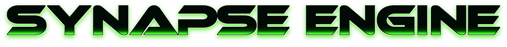

# <!-- Synapse Engine -->

<!--  -->

The Synapse Engine is an open-source game engine written in C++ using SDL2 as it's core graphics library.<!-- Default assets made by @CarlBirch from the BirchEngine -->

## Announcements
### 9/13/2024
I added the tilemap parser that uses TinyXML. If you clone the engine, DO NOT USE THE TILEMAP PARSER AT ALL. IT WILL RESULT IN A SEGMENTATION FAULT. As of now I'm actively trying to fix the issue and in the engine, I commented out the map functions that run with the engine.
Thanks! -Adam

### 9/17/2024
So it wasn't the tilemap parser that was broken, it was just the format of the engine map xml file. So I had to correct that and now it should be showing up fine, but it won't. I'll fix it later. But as of now, it seems that the issue is semi-fixed.
Cheers! -Adam

### 10/10/24
I'm starting to get back to work on the map parser. I was hoping I'd be done with it a month ago, but here I am, still working on getting the map to render to the screen. Everything should be working because the map file is parsed and read, but not drawn to the screen. If anyone wants to commit any changes to try and fix the problem, I would really appreciate it.
Cheers! -Adam

### 10/10/24 #2
The map parser is now working after 3 full months of work and 1 incredibly painful month of attempts to fix it. it turns out these lines,
```
root->Attribute("width", &colCount);
root->Attribute("height", &rowCount);
```
were backwards so I had to swap row count in width for col count from height. I'm just glad that my suffering is over (for now) and I can finally move onto the camera view port. Also I added a more minimal map for testing reasons and it can be used to test individual layer rendering. You can now test the map parser and it should work just fine. If anyone has any issues with it, just leave an issue and I'll see what I can do.
Cheers! -Adam

### 10/15/24
I've implemented the camera mechanic into the engine. I'm also working on the collision handling for it as well. It may be a while before I finish it, but you have to remember that I'm the only one working on this engine, so everything is gonna move slowly. For now, enjoy the camera!
Cheers! -Adam

### 10/16/24
I've coded the basic collision handler and I'm now going to work on the animation states. As of now, I'm thinking of reworking the engine again, due to the fact that both times I've coded it I've used YouTube tutorials and other guides online. I'm thinking I start over and leave myself to figure everything out. Its a way to help me think like a programmer and escape tutorial hell. For now I'll finish what I've already started. I'm still debating it, so it may or may not happen. That's about it for now, good luck with your Synapse projects.
Cheers! -Adam

### 11/14/24
I've added quite a few things as of now. Textures are now to be parsed from xml files for easier access and organization. Animation has been reworked. There's the basic spritesheet animation and then there's the new sequence animation. It hasn't been tested yet, so if anyone is using the engine, please give it a shot and let me know how it works. As of now I'm working on the game object generator for easier game object creation and usability. That's all. Good luck with your synapse projects!
Cheers! -Adam

### 1/16/25 **NEW**
Decided to step away from this project for a bit. Today I decided I was going to finally code and fix the engine's state functions. As of now, I'm happy to say that the game states are finally implemented. I'll now begin work on the camera component for the engine. Happy late new year!!
Cheers! -Adam

## Recent Updates
Beta 0.65 adds a better map parser, some bug fixes, and a camera movement system.

## Small Reminder
Currently, all of the releases are labeled as pre-releases because the engine is still in beta. so please remember that they're unstable versions of the engine and there's a chance that there's bugs in the code.

## Getting Started
To use the engine, you must be using MacOS or Linux, this doesn't work with Windows(sorry windows users). In addition, you must have either the GCC/G++ or Clang/Clang++ installed on your device. If you're using MacOS, then Xcode and HomeBrew must be installed on your device. Once you have these dependencies installed and working, you're ready to move onto the next step. Start off by installing SDL2 and SDL2_Image on your device.

Apt package manager:

```
$ sudo apt install libsdl2-dev
$ sudo apt install libsdl2-image-dev
```

DNF package manager:

```
$ sudo dnf install SDL2-devel
$ sudo dnf install SDL2_image-devel
```

Yum package manager:

```
$ yum install SDL2-devel
$ yum install SDL2_image-devel
```

HomeBrew (MacOS)

```
$ brew install sdl2
$ brew install sdl2_image
```

## Downloading The Engine

Next, download the latest release of the engine's source code from the releases tab.
Once you have the source code zip, unzip it using what ever you would normally use.
Next, open your prefered text editor/IDE, open the source code folder and open up the main.cpp file.
Now You're ready to start your game!

<!-- ## Using The Engine -->
